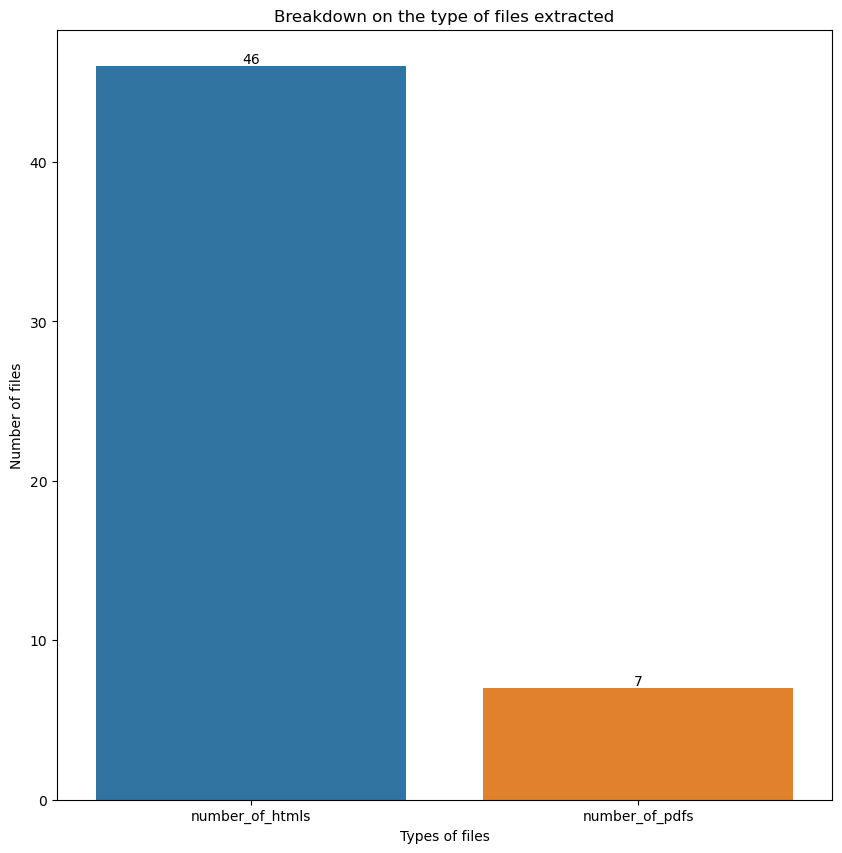

#  Capstone Project: Chat assistant ​for Complementarity Assessment Framework (COMPASS)

### Problem Statement

COMPASS is a new points-based framework that was announced in Mar 2022 for Employment Pass (EP) approvals. COMPASS considers both individual and firm-related attributes to holistically evaluate an EP applicant’s complementarity.

This framework applies to new EP applications from 1 September 2023, and renewals of EPs expiring from 1 September 2024. Since 2023, there have been ongoing updates and media coverage about the criteria to help prepare businesses when applying or renewing the employment passes. 

While there are various channels that businesses can rely on to get information about COMPASS, there has not been any that could provide 24/7 support and immediate assistance for the queries that businesses might have when planning for the applications and/or renewals of EPs. 

The objective of the project is to build a customised chatbot that can provide 24/7 support and immediate assistance for the queries relating to COMPASS.

---

### Data Used

[`MOM website`](https://www.mom.gov.sg/passes-and-permits/employment-pass/eligibility): Data is scraped from MOM website, under segment on Eligibility.
1) Eligibility
2) COMPASS C1. Salary benchmarks
3) COMPASS C5. Skills bonus - Shortage Occupation List (SOL)
4) COMPASS C6. Strategic Economic Priorities (SEP) bonus

---

### Summary of Data Extracted

A total of 53 files were extracted, 7 of them were PDF files and 46 of them were HTML files. 

---

### Notebook description

* [`01_Data_collection_and_visualisation`](/code/01_Data_collection_and_visualisation.ipynb): Scraped relevant URLs related to COMPASS from MOM website to prepare the knowledge base for the chatbot.
* [`02_Creation_of_chatbot`](/code/02_Creation_of_chatbot.ipynb): Created two chatbots, one based on just the knowledge base curated from the extraction of data and another which has an added system prompt. This codebook also includes metrics used to evaluate the performance of the chatbot to guide us in deciding which chatbot to deploy.

---

### Conclusion

- The chatbot that included system prompt has a better RAGAS score of 0.86 compared to 0.81, and was able to provide more context to users in the responses. Albeit the slight delay in execution time during the testing, the chatbot with system prompt provides more context in its responses and is preferred over a shorter answer which lacks explanation. 
- This chatbot (https://chatbot-compass.streamlit.app) is available 24/7 to help provide users who need quick answers about COMPASS via their laptops, computers, and even mobile devices.

---

### Next steps

#### Phase 1 - Improvise the chatbot to achieve RAGAS score > 0.9. 
- Iterating the system prompts, exploring various LLM and embedding models to reduce the execution time and generate satisfactory responses

#### Phase 2 - Piloting the improvised chabot for three months to gather feedback from a smaller pool of users and refine accordingly
- Using MOM's official Telegram channel(/sgministryofmanpower) to reach out to users
  
#### Phase 3 - Deploy the refined chatbot on MOM website for any users to enquire about COMPASS
- Expanding the use of the refined chatbot to reach out to all visitors of MOM website.

---
